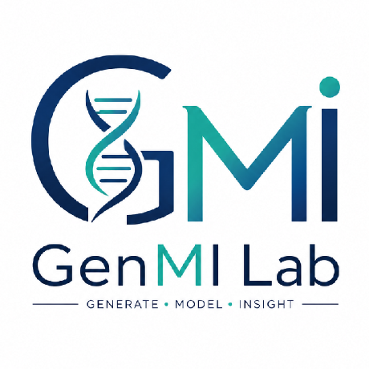
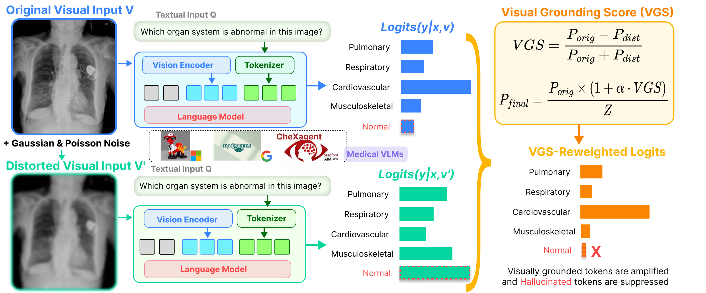
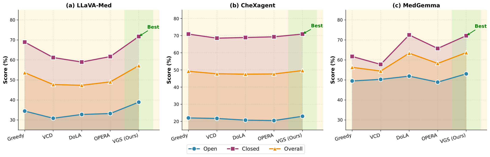
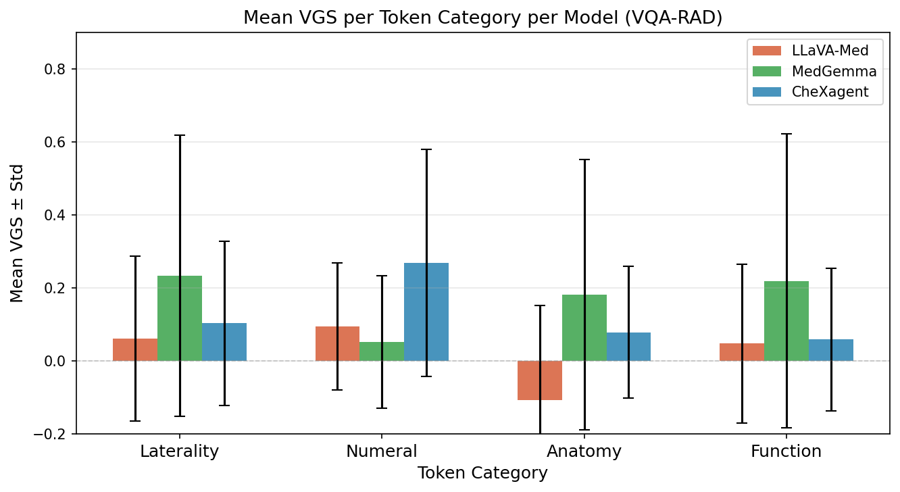

<h1 align="center">
  
  <strong>VGS-Decoding: Visual Grounding Score Guided Decoding for Hallucination Mitigation in Medical VLMs</strong>
</h1>

<div align="center">

<a href="https://git.io/typing-svg">
  
</a>

[](https://genmilab.github.io/VGS-Decoding/)
[](https://arxiv.org/abs/2603.20314)
[](https://huggingface.co/datasets/flaviagiammarino/vqa-rad)
[](LICENSE)
[](https://visitorbadge.io/status?path=https%3A%2F%2Fgithub.com%2Fgenmilab%2FVGS-Decoding)

<h3>🌐 <a href="https://genmilab.github.io/VGS-Decoding/">Project Page</a> &nbsp;|&nbsp; 📄 <a href="https://arxiv.org/abs/2603.20314">Paper</a> &nbsp;|&nbsp; 💻 <a href="#-quick-start">Code</a></h3>

**[Govinda Kolli](https://github.com/govindakolli)<sup>\*</sup>, [Adinath Madhavrao Dukre](https://github.com/adinathdukre)<sup>\*</sup>, Yifan Lu, Ziyun Zou, Dwarikanath Mahapatra, Behzad Bozorgtabar, Imran Razzak**

<sup>\*</sup> Equal first authors



</div>

## 🔥 News
- **[21 Sep 2026]** 🚀 Inference code for **LLaVA-Med** and **MedGemma** on **VQA-RAD**, the [project page](https://genmilab.github.io/VGS-Decoding/) and an [interactive demo](hf_demo/README.md) setup are released.
- **[19 Mar 2026]** ⛳ Our preprint is live on [arXiv](https://arxiv.org/abs/2603.20314). Check it out for details.

## Overview
Medical vision-language models (VLMs) can produce fluent answers that are not supported by the image, often because the language prior outweighs the visual evidence. We propose **V**isual **G**rounding **S**core (**VGS**) guided decoding, a *training-free* inference strategy that measures, for every candidate token, how much its probability depends on the image. At each step **`VGS`** compares the next-token distribution under the original image with the distribution under a Gaussian-plus-Poisson perturbed copy. Visually grounded tokens are amplified and tokens that remain likely without reliable visual evidence are suppressed, with no change to the base model.

<details open>
<summary>VGS-Decoding Framework</summary>



</details>


## 🏆 Main Results

**Table 1.** Comparison of decoding methods across three medical VLM backbones and three medical VQA benchmarks. *Open*: token-level recall on open-ended questions; *Closed*: accuracy on closed-ended questions; *Overall*: question-count-weighted mixed score (all in %). **Bold**: best within each backbone and metric.

<div align="center">

<table>
<tr><th rowspan="2">Backbone</th><th rowspan="2">Method</th><th colspan="3">VQA-RAD</th><th colspan="3">SLAKE</th><th colspan="3">MIMIC-Diff-VQA</th></tr>
<tr><th>Open</th><th>Closed</th><th>Overall</th><th>Open</th><th>Closed</th><th>Overall</th><th>Open</th><th>Closed</th><th>Overall</th></tr>
<tr><td rowspan="5"><b>LLaVA-Med</b></td><td>Greedy</td><td>34.45</td><td>68.92</td><td>53.64</td><td>40.81</td><td>62.25</td><td>49.22</td><td>28.04</td><td>48.39</td><td>35.39</td></tr>
<tr><td>VCD</td><td>30.85</td><td>61.20</td><td>47.71</td><td>39.50</td><td>60.56</td><td>47.76</td><td>25.98</td><td>46.42</td><td>33.33</td></tr>
<tr><td>DoLA</td><td>32.76</td><td>58.96</td><td>47.34</td><td><b>42.54</b></td><td>61.97</td><td>50.16</td><td>28.75</td><td>47.94</td><td>35.68</td></tr>
<tr><td>OPERA</td><td>33.22</td><td>61.69</td><td>49.05</td><td>31.25</td><td>58.59</td><td>41.97</td><td>21.18</td><td>46.02</td><td>30.14</td></tr>
<tr><td><b>VGS (Ours)</b></td><td><b>38.90</b></td><td><b>72.91</b></td><td><b>57.75</b></td><td>41.11</td><td><b>75.21</b></td><td><b>54.48</b></td><td><b>30.84</b></td><td><b>55.79</b></td><td><b>39.86</b></td></tr>
<tr><td rowspan="5"><b>CheXagent</b></td><td>Greedy</td><td>22.02</td><td>70.92</td><td>49.24</td><td><b>44.14</b></td><td>69.30</td><td>54.00</td><td><b>44.06</b></td><td>82.07</td><td>57.79</td></tr>
<tr><td>VCD</td><td>21.73</td><td>68.53</td><td>47.78</td><td>43.01</td><td>66.20</td><td>52.10</td><td>38.88</td><td>79.14</td><td>53.42</td></tr>
<tr><td>DoLA</td><td>20.73</td><td>68.92</td><td>47.55</td><td>42.95</td><td>69.01</td><td>53.17</td><td>39.78</td><td>81.94</td><td>55.02</td></tr>
<tr><td>OPERA</td><td>20.50</td><td>69.32</td><td>47.67</td><td>38.19</td><td>69.30</td><td>50.39</td><td>36.19</td><td>82.03</td><td>52.75</td></tr>
<tr><td><b>VGS (Ours)</b></td><td><b>23.48</b></td><td><b>71.31</b></td><td><b>50.10</b></td><td>43.75</td><td><b>70.14</b></td><td><b>54.10</b></td><td>43.99</td><td><b>82.53</b></td><td><b>57.91</b></td></tr>
<tr><td rowspan="5"><b>MedGemma</b></td><td>Greedy</td><td>49.50</td><td>61.75</td><td>56.32</td><td>54.74</td><td>73.56</td><td>62.12</td><td>25.97</td><td>73.55</td><td>43.16</td></tr>
<tr><td>VCD</td><td>50.29</td><td>57.77</td><td>54.45</td><td>54.00</td><td>66.35</td><td>58.84</td><td>29.38</td><td>68.76</td><td>43.61</td></tr>
<tr><td>DoLA</td><td>51.91</td><td>72.51</td><td>63.38</td><td><b>58.71</b></td><td>79.57</td><td><b>66.89</b></td><td>32.56</td><td>76.82</td><td>48.55</td></tr>
<tr><td>OPERA</td><td>48.90</td><td>65.74</td><td>58.27</td><td>58.61</td><td>76.92</td><td>65.79</td><td>28.35</td><td>75.53</td><td>45.40</td></tr>
<tr><td><b>VGS (Ours)</b></td><td><b>53.05</b></td><td><b>73.58</b></td><td><b>64.48</b></td><td>54.25</td><td><b>85.82</b></td><td>66.63</td><td><b>34.95</b></td><td><b>82.91</b></td><td><b>52.28</b></td></tr>
</table>

</div>

<p align="center">
  
  <br/>
  <em>Performance of Greedy, VCD, DoLA, OPERA and VGS across LLaVA-Med, CheXagent and MedGemma. See Table 1 for exact scores.</em>
</p>

<p align="center">
  
  <br/>
  <em>Qualitative example on abdominal CT: baselines name the wrong organ, while VGS answers <b>small bowel</b>.</em>
</p>

<details>
<summary>Token-level analysis: mean VGS per token category (VQA-RAD)</summary>

<p align="center"></p>

</details>

## 📖 Contents
- [🏆 Main Results](#-main-results)
- [⛏️ Installation](#️-installation)
- [🧩 Models and Weights](#-models-and-weights)
- [⚡ Quick Start](#-quick-start)
  - [CLI Inference](#cli-inference)
  - [Baseline Inference](#baseline-inference)
  - [Script Inference](#script-inference)
  - [Gradio Web Interface](#gradio-web-interface)
- [🛠️ Advanced Usage](#️-advanced-usage)
  - [Parameter Settings](#parameter-settings)
  - [Multi-GPU and Offline Runs](#multi-gpu-and-offline-runs)
  - [Outputs](#outputs)
- [🗂️ Dataset](#️-dataset)
- [📊 Evaluation](#-evaluation)
- [📝 Citation](#-citation)
- [📚 Acknowledgments](#-acknowledgments)
- [📨 Contact](#-contact)
- [📜 License](#-license)
- [🧰 Intended Use](#-intended-use)

## ⛏️ Installation

> [!NOTE]
> Requirements: Python 3.10, PyTorch 2.7.1, Transformers 4.53.0 and a CUDA GPU. MedGemma additionally needs bfloat16 support. Our experiments ran on NVIDIA A100 40 GB GPUs.

1. Clone the repository and navigate to the project folder

```bash
git clone https://github.com/genmilab/VGS-Decoding.git
cd VGS-Decoding
```

2. Set up the environment and install in editable mode

```bash
conda create -n vgs python=3.10 -y
conda activate vgs
pip install torch==2.7.1 torchvision==0.22.1 --index-url https://download.pytorch.org/whl/cu128
pip install -e .
```

> [!TIP]
> We recommend a separate environment per backbone (e.g. `vgs-llavamed` and `vgs-medgemma`). The CUDA 12.8 wheels need a compatible NVIDIA driver; see [PyTorch previous versions](https://pytorch.org/get-started/previous-versions/) for other builds.

<details>
<summary> 🔄 Upgrade to the latest code base </summary>

```Shell
git pull
pip install -e .
```

</details>

## 🧩 Models and Weights

| Model | CLI name | Checkpoint | Precision |
|--------|----------|-------------|-----------|
| **LLaVA-Med-v1.5 (7B)** | `llava-med` | [chaoyinshe/llava-med-v1.5-mistral-7b-hf](https://huggingface.co/chaoyinshe/llava-med-v1.5-mistral-7b-hf) | float16 |
| **MedGemma (4B)** | `medgemma` | [google/medgemma-4b-it](https://huggingface.co/google/medgemma-4b-it) | bfloat16 |

Weights are downloaded automatically to the Hugging Face cache (`~/.cache/huggingface`) on the first run. MedGemma is gated: accept its terms on Hugging Face, then log in once.

```bash
huggingface-cli login
```

<details>
<summary> 📦 Pre-download weights to a local folder (clusters / offline machines) </summary>

```bash
huggingface-cli download chaoyinshe/llava-med-v1.5-mistral-7b-hf \
  --revision 627be53734c667cbb1669608dac747a4485a22d7 \
  --local-dir checkpoints/llava-med-v1.5-mistral-7b-hf

huggingface-cli download google/medgemma-4b-it \
  --revision 290cda5eeccbee130f987c4ad74a59ae6f196408 \
  --local-dir checkpoints/medgemma-4b-it
```

Suggested layout:

```text
VGS-Decoding/
├── checkpoints/
│   ├── llava-med-v1.5-mistral-7b-hf/
│   └── medgemma-4b-it/
└── data/
    └── vqa-rad/        # VQA-RAD test split as an Arrow file
```

Then pass `--model-path checkpoints/<name>` (see [Multi-GPU and Offline Runs](#multi-gpu-and-offline-runs)).

</details>

> [!WARNING]
> The LLaVA-Med checkpoint is a Hugging Face-format conversion; weights from the original LLaVA repository will not load. Both revisions are pinned in `vgs_decoding.py`. Never put access tokens in source files, commands or commits.

## ⚡ Quick Start

### CLI Inference
Run VGS decoding on VQA-RAD directly from the command line:

```Shell
# LLaVA-Med + VGS
python vgs_llavamed_vqarad.py \
  --device cuda:0 --limit 3 \
  --output-dir outputs/llava-med-vgs

# MedGemma + VGS
python vgs_medgemma_vqarad.py \
  --device cuda:0 --limit 3 \
  --output-dir outputs/medgemma-vgs
```

Remove `--limit` to process the full test split. The installed console scripts `vgs-llavamed-vqarad`, `vgs-medgemma-vqarad` and `vgs-vqarad --model <name>` are equivalent.

**Optional arguments:**

| Argument | Description | Default |
|-----------|--------------|----------|
| `--alpha` | Strength of VGS reweighting (`0` = greedy) | 1.0 |
| `--min-factor` | Lower bound on the multiplicative factor | 0.01 |
| `--gaussian-std` | Gaussian noise std on RGB values in [0, 1] | 0.07 |
| `--poisson-scale` | Poisson rate scale | 70.0 |
| `--max-new-tokens` | Maximum generated tokens | 64 |
| `--save-token-trace` | Save per-token probabilities and VGS values | off |

### Baseline Inference
Set `--alpha 0` to obtain the greedy baseline with the identical prompt, precision and stopping rule:

```Shell
python vgs_llavamed_vqarad.py --alpha 0 --output-dir outputs/llava-med-greedy
python vgs_medgemma_vqarad.py --alpha 0 --output-dir outputs/medgemma-greedy
```

> [!NOTE]
> VCD, DoLA and OPERA baselines, the CheXagent backbone, and the SLAKE and MIMIC-Diff-VQA pipelines reported in the paper are not part of this release. Please use the official implementations of those methods.

### Script Inference
Answer a question about any image programmatically with the shared decoder in `vgs_decoding.py`:

```python
import torch
from PIL import Image
from vgs_decoding import DecodingConfig, decode, load_model, perturb_image

bundle = load_model("medgemma", torch.device("cuda:0"))   # or "llava-med"
config = DecodingConfig(alpha=1.0)                         # alpha=0 -> greedy

image = Image.open("./path/to/image.png").convert("RGB")
question = "Is there evidence of pneumothorax?"
distorted = perturb_image(image, config, seed=config.seed)

result = decode(
    bundle.model,
    bundle.prepare(image, question),
    bundle.prepare(distorted, question),
    config,
    bundle.stop_token_ids(),
)
print(bundle.processor.tokenizer.decode(result.token_ids[0], skip_special_tokens=True).strip())
```

<details>
<summary>💡 Inspect the token-level VGS trace.</summary>

```python
for step in result.steps:
    print(step)   # chosen token, clean probability and VGS value
```

> 👉 Only batch size 1 and the two listed backbones are supported. Other architectures need a new adapter in `vgs_decoding.py`.

</details>

### Gradio Web Interface

Build and launch the demo locally with Docker:

```bash
docker build -f hf_demo/Dockerfile -t vgs-decoding-demo .
docker run --rm --gpus all -p 127.0.0.1:7860:7860 -e HF_TOKEN vgs-decoding-demo
```

Open `http://127.0.0.1:7860`, choose MedGemma or LLaVA-Med, load a VQA-RAD example or upload a de-identified image, adjust `alpha`, and inspect the answer with its token-level VGS trace. See [hf_demo/README.md](hf_demo/README.md) for a non-Docker setup.

## 🛠️ Advanced Usage

### Parameter Settings

- **`alpha` (≥ 0)**: Strength of VGS reweighting
  - `0`: plain greedy decoding
  - Higher = stronger promotion of visually grounded tokens
  - Default: 1.0

- **`gaussian-std` / `poisson-scale`**: Perturbation applied to the image copy
  - Defaults: 0.07 / 70.0

- **`min-factor` (0, 1]**: Floor on the reweighting factor, so no token is removed entirely
  - Default: 0.01

The rule applied at every step, with $p$ and $q$ the clean and perturbed next-token distributions:

$$
\mathrm{VGS}(y) = \frac{p(y) - q(y)}{p(y) + q(y) + \epsilon},
\qquad
P_{\text{final}}(y) \propto p(y)\cdot\max\bigl(1 + \alpha\,\mathrm{VGS}(y),\ m\bigr)
$$

Full details are in [docs/decoding.md](docs/decoding.md).

### Multi-GPU and Offline Runs

Each command loads one model on one device. Split the dataset across GPUs with `--start` / `--limit`; noise is seeded by `seed + dataset_index`, so partitions match a single run.

```Shell
python vgs_medgemma_vqarad.py --device cuda:0 --start 0   --limit 226 --output-dir outputs/mg-part0 &
python vgs_medgemma_vqarad.py --device cuda:1 --start 226             --output-dir outputs/mg-part1 &
```

Run from local weights and data without network access:

```Shell
HF_HUB_OFFLINE=1 python vgs_medgemma_vqarad.py \
  --model-path checkpoints/medgemma-4b-it \
  --dataset-arrow data/vqa-rad/vqa-rad-test.arrow \
  --local-files-only --output-dir outputs/medgemma-offline
```

### Outputs

```text
outputs/<run-name>/
├── predictions.jsonl   # question ID, question, answer, model, seed, token count, stop reason
└── run.json            # settings, checkpoint revision, dataset fingerprint, versions, status
```

> [!TIP]
> Each output directory must be new; existing runs are never overwritten. To resume after a failure, use a new directory with `--start` at the next unfinished index and the same seed.

## 🗂️ Dataset

- [**VQA-RAD**](https://huggingface.co/datasets/flaviagiammarino/vqa-rad): radiology visual question answering (test split by default). Downloaded automatically.

The paper additionally evaluates on **SLAKE** and **MIMIC-Diff-VQA**; runners for these are not included in this release.

> [!NOTE]
> Only the image, question and question ID are read. Reference answers are never passed to the model or saved. Models and data remain subject to their own licenses.

## 📊 Evaluation

This release generates answers only; no accuracy, recall or hallucination metrics are computed. The paper reports open-question recall, closed-question accuracy and a question-weighted overall score. Complete tables for all backbones and datasets are on the [project page](https://genmilab.github.io/VGS-Decoding/).

## 📝 Citation

If you find our paper and code useful in your research, please cite using this BibTeX:

```bibtex
@misc{kolli2026vgs,
  title         = {VGS-Decoding: Visual Grounding Score Guided Decoding for
                   Hallucination Mitigation in Medical VLMs},
  author        = {Govinda Kolli and Adinath Madhavrao Dukre and
                   Behzad Bozorgtabar and Dwarikanath Mahapatra and Imran Razzak},
  year          = {2026},
  eprint        = {2603.20314},
  archivePrefix = {arXiv},
  primaryClass  = {cs.CV},
  doi           = {10.48550/arXiv.2603.20314},
  url           = {https://arxiv.org/abs/2603.20314}
}
```

## 📚 Acknowledgments

This project builds upon the following open-source works:

- [**LLaVA-Med**](https://github.com/microsoft/LLaVA-Med): a biomedical vision-language assistant.
- [**MedGemma**](https://huggingface.co/google/medgemma-4b-it): medical vision-language models from Google.
- [**VQA-RAD**](https://huggingface.co/datasets/flaviagiammarino/vqa-rad): a radiology visual question answering dataset.
- [**Hugging Face Transformers**](https://github.com/huggingface/transformers): model loading and generation utilities.

We thank the authors for their valuable contributions to the medical AI community.

## 📨 Contact
For questions or collaboration, please open an [issue](https://github.com/genmilab/VGS-Decoding/issues) or reach out to the code contributors: [Govinda Kolli](https://github.com/govindakolli) and [Adinath Madhavrao Dukre](https://github.com/adinathdukre).

## 📜 License

This project is licensed under the MIT License. See the [LICENSE](LICENSE) file for details.

## 🧰 Intended Use

**VGS-Decoding** is intended for **research** on hallucination and visual grounding in medical vision-language models.

### Key Applications

- 🔬 **Research Utility**: study how strongly generated tokens depend on visual evidence, and compare decoding strategies.
- 🧪 **Model Analysis**: inspect token-level VGS traces to find answers that rely on language priors.
- 🎓 **Education**: illustrate grounding and hallucination behaviour of medical VLMs.

> [!IMPORTANT]
> VGS is a perturbation-sensitivity signal, not a clinical confidence score. Outputs must not inform any clinical decision.

---

<details>
<summary><strong>Limitations and Recommendations</strong></summary>

1. **Perturbation Choice**: the Gaussian-plus-Poisson perturbation is empirical and not a validated acquisition model for every imaging modality.
2. **Scope**: experiments concern research benchmarks with short answers; performance on other tasks or modalities is untested.
3. **Compute**: each generated token requires two forward passes (clean and perturbed image).
4. **Reproducibility**: identical seeds do not guarantee bitwise identity across GPUs, package versions or model revisions.

</details>

<details>
<summary><strong>Ethical Considerations</strong></summary>

- **Patient Privacy**: all input images must be fully de-identified and compliant with HIPAA, GDPR or equivalent local regulations.
- **Responsible Use**: outputs may contain inaccuracies and should be interpreted with caution.
- **Accountability**: responsibility for verification lies with the end user.

</details>

<details>
<summary><strong>Disclaimer</strong></summary>

This code is intended **solely for research and educational purposes**. It is **not approved** by the FDA, CE or any other regulatory authority for clinical use. For medical diagnosis or treatment, please consult a licensed healthcare professional.

</details>
